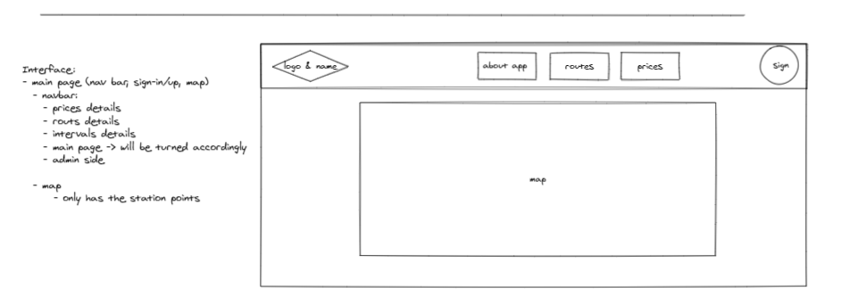
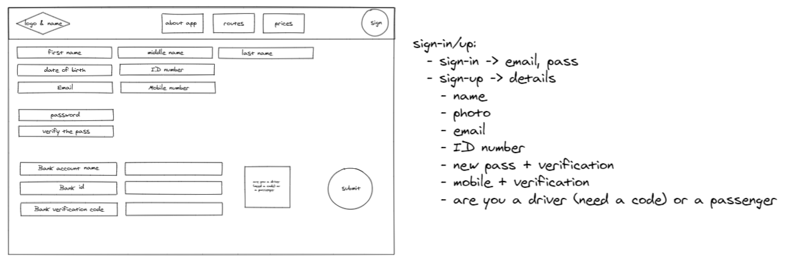

# **Amman Bus Management System**

Amman Bus Management System is a Full-Stack web application built with Python - Django for the backend, JavaScript - React JS for the frontend, and TailwindCSS for the styling.

Through this web application the users would be able to keep track of various things regarding the buses's schedule and booking trips, and much more considering that the user is authenticated as either a driver or a passenger. But if the user is not registered or singed-in they'll still be able to view the buses's stations, routes and prices.

</br>

## **Amman Bus Management System Features:**

The features of Amman Bus Management System are:

- **Home Page:**

    In this page, variety of functionalities wil be rendered the guest user before any kind of registered authentication.

    Where they'll be to navigate through the following, using the navbar:

        1. Timelines: showcases the buses's time schedule in respect to their routes.
        2. Stations: showcases the points at which the buses collect passengers.
        3. Routes: showcases more detailed information about the paths that the buses take, and how much they usually take.
        4. Prices: showcases the fixed prices for each bus trip.
        5. services: This page would only be rendered to registered users; drivers and passengers, to show them detailed information that concerns them.
    
    The homepage is also where users can sign-up & sign-in as either drives or passengers, and by doing so they'll be granted different authentications.

    It also showcases a map, as it a vital point of reference while viewing the buses's schedule.

- **Sign-up Page:** 

    This is the page where the user gets to register and gain more freedom of access but only as a passenger, and that's because we have decided to only register authenticated drivers on the admin dashboard directly after being selected carefully, which seemed like a more practical solution for future modifications to the project.

- **Sign-in Page:**

    This page allows previously registered users; drivers & passengers, to sign-in into their accounts directly after authenticating that it is actually them.

- **Driver Interface:**

    This page would be rendered to the signed-in driver, only after clicking on *services* from the Navbar. 
    
    The content that's going to be rendered would only be relative the driver, this content would include the following:

        - Scan QR-Code: to scan the QR code of the passengers as a verification method.

- **Passenger Interface:**
    
    This page would be rendered to the signed-in passenger, only after clicking on *services* from the Navbar. 
    
    The content that's going to be rendered would only be relative the passenger, this content would include the following:

        - Plan Your Trip: where the passenger can select pick-up and drop-off stations on the map.
        - Available Buses: To view available buses.
        - My Plan's QR-Code: To render a QR-Code after choosing a plan.
        


</br>

## **Planning of the Project**

### **Overall Features**


### **Home Page**



### **Driver Sign-up Page**


### **Driver Interface**


## **Passenger Sign-up Page**



### **Passenger Interface**


</br>

## **Used Libraries and Tools**

### **Libraries and Frameworks:**

- #### **For the backend:**
    - Django
    - Poetry
    - Pip


- #### **For the frontend:**
    - React JS
    - TailwindCSS

### **Tools:**

- VS Code
- Zoom
- Github
- Slack
- Discord
- Powerpoint
- Replit

</br>

## **Amman Bus Management System Visual**

</br>

## **A Guide to Getting Started**

The Amman Bus Management System has been built on the concept of separating the front and backend.


- If you wish to contribute to the code, follow these steps:

1. Clone the repo:

    ```
    ```

2. Make sure you have Docker installed on your machine, whilst working.

    And then open it, and run the following command:

    ```
    $ docker-compose build ---> to build the container

    $ docker-compose up ----> to run the server
    ```

- if you wish to only view the web application, just visit this deployed site:


</br>

## **Authors and Developers behind Amman Bus Management System**

- Sarah Hudaib
- Mustafa Alhasanat
- Batool Ragaya'h
- Salim Hassouneh