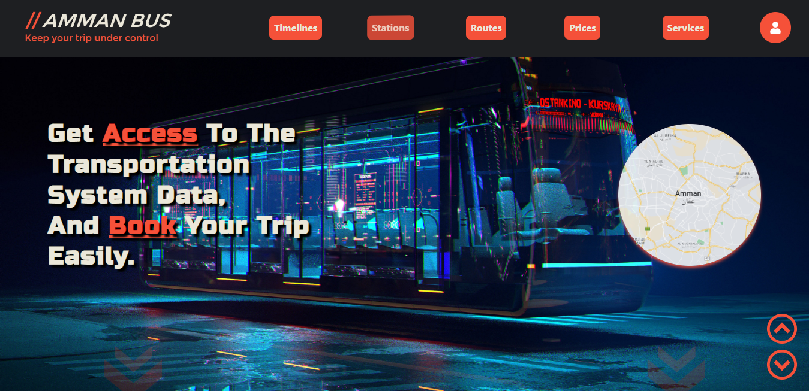
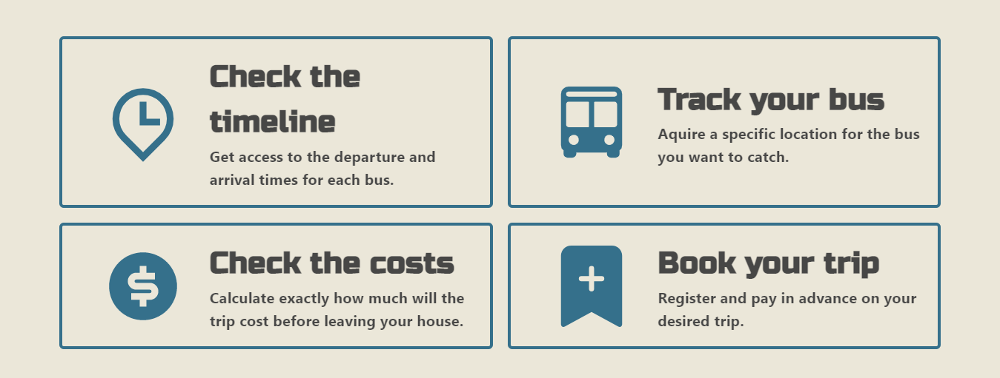
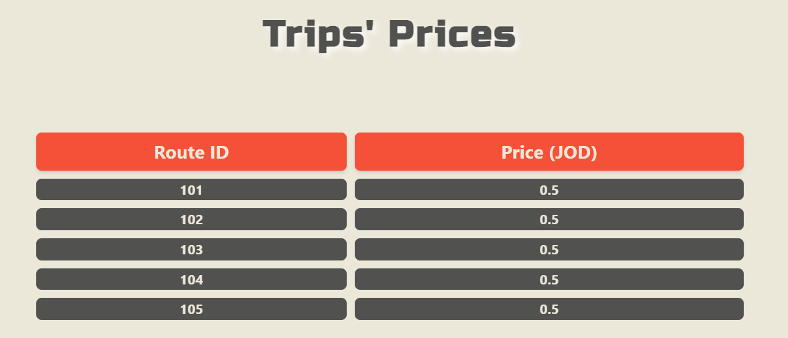
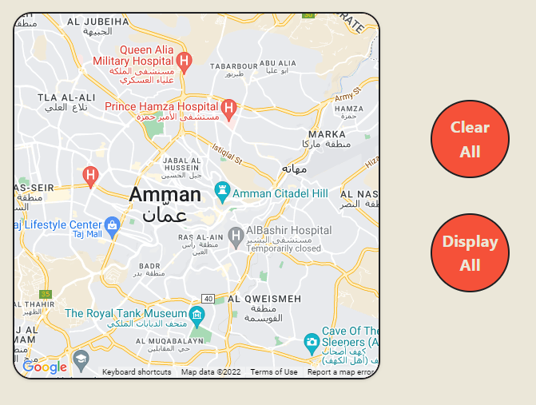
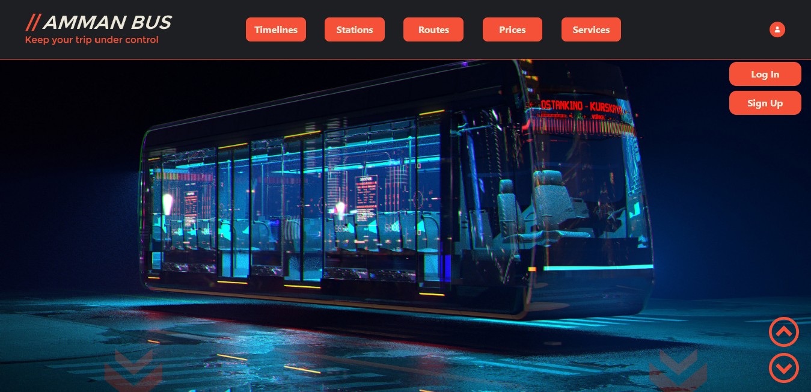

## **Amman Bus Management System Features and Interfaces**

 

- **Home Page**

    
    

    This page is the first to view when visiting the websites, and it allows guests to Navigate through some of the functionalities the site offers, and those are:

     

    1. **Buses' Timelines**

        

        The guest wil be able to keep track of different buses they choose from the map. Based on their IDs, what route they're on, when do they leave one station and when do they arrive at another, in addition to the buses's capacity and lastly the given ratings of passengers.

     

    2. **Buses's Stations**

        The guest wil be able to keep track of different stations they choose from the map. Where they'll get the station's ID, its name, and what routes that passes through it.

     

    3. **Buses's Routes**

        The guest wil be able to keep track of different routes they choose from the map.

        Finding out the route's ID, where do they start and end, the stations in the routes's way, and and how much time and distance it takes to cross them.

     

    4. **Trips' Prices**

        

        The guest wil be able to learn how much money it costs to go on a bus trip bases on which route they're on.

     

    5. **Map**

        

        The guest uses the map to point to certain routes, or stations to learn more about them in the above features.

 

 

- **Accounts**

    To the very right of the Navbar, there is a drop down menu where the guest gets to either sign-in or sign-up, noting that the guests are only allowed to register or sign-up as passengers only.

    

    As can be seen, when the button is pressed the guest is given the two only options, and if clicked on either of them, the guest will be referred to another page.

     

    1. **Sign-up**

        

        In this page the first time guest would be able to register only as a passenger by filling up a form.

     

    2. **Log-In**

        

        In this page the already registered user will be able to sign in into their account by providing the Email and Password.

        The user can be both, driver and passenger.

 

 

- **Interfaces**